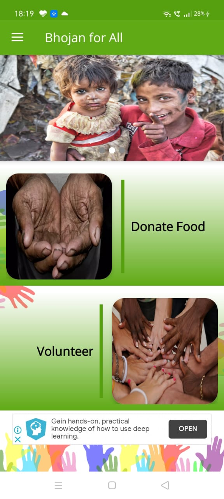

<h1 >Bhojan for All</h1> 
<h3><i>Donate Now Feed Many</i></h3>

  

 

 &nbsp;
 &nbsp;
 &nbsp;
 &nbsp;
 
  

<h3 align="center">
    🔹
    <a href="https://github.com/saikiran1224/Bhojan_for_All/issues">Report Bug</a> &nbsp; &nbsp;
    🔹
    <a href="https://github.com/saikiran1224/Bhojan_for_All/issues">Request Feature</a>
</h3>

 

## TL;DR
If you would like to use this application, fork the repository and link back to [saikiran1224](https://github.com/saikiran1224) for proper credits. Thanks in Advance! 

## 🧠 Motivation behind Developing this Application

Food is precious for everyone and due to poverty, there are cases where they couldn't eat for one time in a whole day. On the other side, people are wasting food unknowingly at many places like Houses, Functions, Restaurants, etc. To overcome this problem instead of wasting food we can directly handover to the poor persons. To solve this problem, I have developed this application where we took the help of Volunteers who will be helping us. 

## Working of Bhojan for All

It is simply a connection establishment between the Food Donors be it Houses, Restaurants and places where Functions happens and the Volunteers. This is an Android Application which becomes handy to the Donors as well as the Volunteers to easily interact with the app. To provide a seamless experience to the Donor, the UI is designed in such a way that it nearly takes just ***60 seconds*** to place a Food Donation in the app. The following is a representation of how the app works in real time

  

Since food is perishable, we have also asked some questions to Donor about the approximate time when food is prepared and it is proven that Food is not good for consumption once it crosses the time period of 6 Hours, along with we have asked the Donor to give information about the approximate quantity that the food gets sufficient in quantity of persons. Once the Volunteer has delivered the food to poor, a picture of proof will be uploaded to the app which counts as a successful donation to the Volunteer. 

We have also added an additional option for **NGOs** to login and Volunteers will also be able to deliver the food directly to the Old Age Homes, etc.

## Outcomes of this Application

- Food Donor gets self satisfied that his/her food fed to poor persons by the photo uploaded into the app once food gets donated.
- Decreases the Global Hunger Rate
- Food will not get wasted unnecessarily
- Contamination of food gets decreased 

## 👷🏼 Built With 

This application is initially developed for **Native Android users** and will be extended to iOS Users in coming future. Any Contributors are open if they are willing to contribute.  

This project was built using these technologies.

- Native Android
- Java
- Firebase
   - Authentication ( Email ID )
   - One Time Password ( OTP )
   - Realtime Database
   - Storage
   - Cloud Messaging
   - Analytics 
- Glide
- Volley

## 🤩 Features

- Donors can place food donation request in just 60 seconds.
- Any one who is interested in donating food are welcome as a Volunteer.
- Donors can check the no. of donations with just help of their Phone Number.
- Highly interactive and User friendly User Interface 
- Volunteers can book thier donation as per thier choice and confimation will be asked.
- We do accept Donation amount for celebrating Various Ocassions like Marriages, Birthdays etc. and whole amount will be sent to NGOs and Poor people.
- Volunteers can contact nearby Police if in case of Emergency.

## Contribute

This project is open for contributors and feel free to `fork` and make a `Pull Request` to the repo. If you feel any enhancements are required don't hesistate to open an issue.

## Screenshots 

<table>
 
 <tr>
   <td width="33.3%">&nbsp;</td>
   <td width="33.33%">&nbsp;</td>
   <td width="33.33%">&nbsp;</td>
 </tr>
 <tr>
   <td align="center">Home Page</td>
   <td align="center">Food Donation Page</td>
   <td align="center">Volunteer Login </td>
 </tr>
 
 <tr>
   <td width="33.3%">&nbsp;</td>
   <td width="33.33%">&nbsp;</td>
   <td width="33.33%">&nbsp;</td>
 </tr>
 <tr>
   <td align="center">Celebrate Occassion</td>
   <td align="center">Emergency for Volunteers</td>
   <td align="center">Report Issues</td>
 </tr>
  
</table>

 

## Show your support 

Follow me for more projects and dont forget to Give a ⭐ if you like this application!
